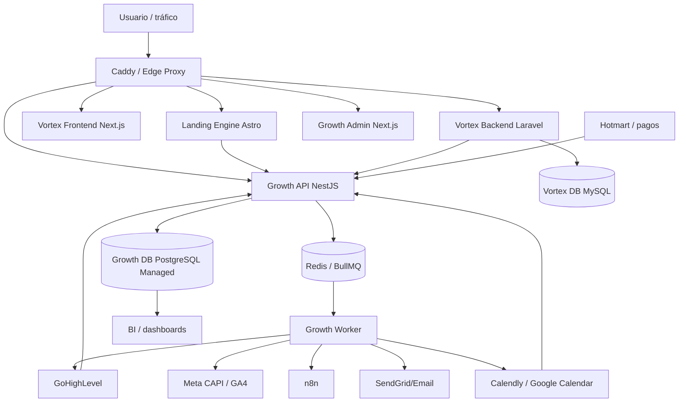
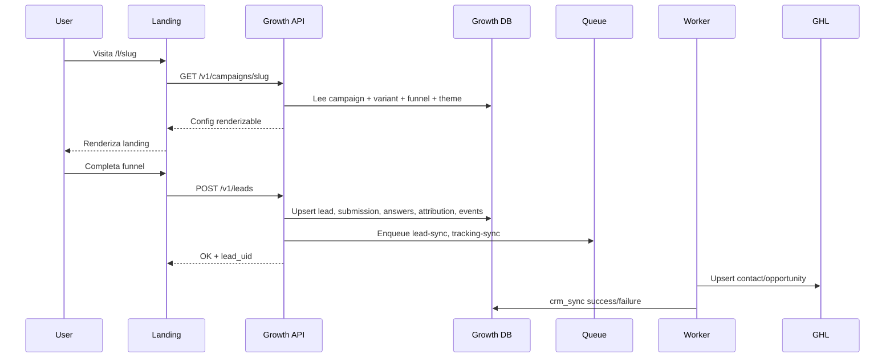

# Diseño técnico: Growth Hub Platform

## Decisión ejecutiva

Construir **Growth Hub** como plataforma separada de Vortex, con:

- **Growth API**: NestJS + Fastify/Express + Prisma.
- **Growth DB**: DigitalOcean Managed PostgreSQL.
- **Growth Worker**: Node/Nest worker con BullMQ.
- **Queue/Cache**: Redis/Valkey gestionado o contenedor dedicado inicial.
- **Landing Engine**: Astro SSR con ruta dinámica `/l/[slug]`.
- **Growth Admin**: Next.js opcional en fase posterior.
- **Object Storage**: DigitalOcean Spaces para raw payloads, exports, assets y backups lógicos.

## Por qué separado de Vortex

Vortex debe escalar como app transaccional para 5.000+ usuarios activos. Su DB y backend deben enfocarse en usuarios, producto, suscripciones, datos financieros y experiencia de usuario. Growth tendrá cargas diferentes: campañas, tráfico de pauta, webhooks, eventos, reintentos, dashboards y comisiones.

Compartir DB/servicio desde el inicio aumentaría acoplamiento, riesgo operativo y dificultad de escalar.

## Vista de alto nivel



## Servicios propuestos

### 1. `growth-api`

Responsabilidades:
- Campaign config API.
- Funnel config API.
- Lead intake.
- Event ingestion.
- Webhook gateway.
- Identity resolution.
- Admin APIs.
- Public API auth para landings.
- Internal API auth para Vortex/webhooks.

Rutas públicas iniciales:

```txt
GET  /v1/campaigns/:slug
POST /v1/events
POST /v1/leads
POST /v1/funnels/:funnelId/submit
```

Rutas webhooks:

```txt
POST /v1/webhooks/ghl
POST /v1/webhooks/vortex
POST /v1/webhooks/hotmart
POST /v1/webhooks/calendly
```

Rutas admin:

```txt
GET/POST /v1/admin/campaigns
GET/POST /v1/admin/funnels
GET     /v1/admin/leads
GET     /v1/admin/events
GET     /v1/admin/integration-logs
```

### 2. `growth-worker`

Responsabilidades:
- Consumir jobs.
- Enviar leads a GHL/n8n.
- Enviar eventos Meta CAPI.
- Procesar webhooks normalizados.
- Sincronizar snapshots con Vortex/GHL.
- Dead-letter y retries.

Colas iniciales:

```txt
lead-sync
tracking-sync
webhook-normalization
vortex-sync
commission-events
```

### 3. `growth-db`

PostgreSQL gestionado en DigitalOcean.

Bases/schemas recomendados:

```txt
database: growth_hub
schema: public inicialmente
```

Si crece:

```txt
core.*
crm.*
vortex.*
commissions.*
audit.*
```

### 4. `landing-engine`

Puede evolucionar desde la landing Astro actual.

Responsabilidades:
- Ruta dinámica `/l/[slug]`.
- Renderizar templates/bloques/themes.
- Capturar UTM y visitor/session IDs.
- Consumir Growth API.
- Enviar eventos/leads solo a Growth API.

### 5. `growth-admin`

No MVP obligatorio, pero previsto.

Responsabilidades:
- Crear campañas.
- Configurar funnels.
- Ver leads y eventos.
- Monitorear integraciones.
- Configurar routing CRM.

## Modelo de datos inicial

### `growth_campaigns`

```txt
id uuid pk
slug text unique
name text
status text -- draft|active|paused|archived
offer_type text
default_variant_id uuid nullable
funnel_id uuid nullable
crm_route_id uuid nullable
seo jsonb
default_tracking jsonb
metadata jsonb
created_at timestamptz
updated_at timestamptz
```

### `growth_campaign_variants`

```txt
id uuid pk
campaign_id uuid fk
variant_key text
template_key text
theme_id uuid nullable
traffic_weight int
status text
sections jsonb
metadata jsonb
created_at timestamptz
updated_at timestamptz
unique(campaign_id, variant_key)
```

### `growth_themes`

```txt
id uuid pk
key text unique
name text
tokens jsonb -- colors, typography, spacing, radius, motion
status text
created_at timestamptz
updated_at timestamptz
```

### `growth_funnels`

```txt
id uuid pk
key text
version int
name text
status text
schema jsonb
scoring jsonb
routing jsonb
metadata jsonb
created_at timestamptz
updated_at timestamptz
unique(key, version)
```

### `growth_leads`

```txt
id uuid pk
lead_uid text unique
primary_email text nullable
primary_phone text nullable
full_name text nullable
qualification_level text nullable
status text
first_campaign_id uuid nullable
last_campaign_id uuid nullable
first_seen_at timestamptz
last_seen_at timestamptz
metadata jsonb
created_at timestamptz
updated_at timestamptz
```

Índices:

```txt
lower(primary_email)
normalized phone
lead_uid
qualification_level
created_at
```

### `growth_lead_submissions`

```txt
id uuid pk
lead_id uuid fk
campaign_id uuid fk
variant_id uuid nullable
funnel_id uuid fk
idempotency_key text unique
source text
answers jsonb
score jsonb
outcome jsonb
client_context jsonb
submitted_at timestamptz
created_at timestamptz
```

### `growth_lead_events`

```txt
id uuid pk
lead_id uuid nullable
campaign_id uuid nullable
session_id text nullable
event_name text
event_key text unique nullable
payload jsonb
occurred_at timestamptz
created_at timestamptz
```

### `growth_attribution_touchpoints`

```txt
id uuid pk
lead_id uuid nullable
campaign_id uuid nullable
session_id text nullable
touch_type text -- first|last|assisted
utm_source text nullable
utm_medium text nullable
utm_campaign text nullable
utm_content text nullable
utm_term text nullable
referrer text nullable
landing_url text nullable
occurred_at timestamptz
created_at timestamptz
```

### `growth_external_identities`

```txt
id uuid pk
lead_id uuid fk
provider text -- ghl|vortex|hotmart|calendly|meta|n8n
external_id text
external_type text -- contact|user|deal|transaction|invitee
metadata jsonb
created_at timestamptz
updated_at timestamptz
unique(provider, external_type, external_id)
```

### `growth_crm_syncs`

```txt
id uuid pk
lead_id uuid fk
provider text
status text -- pending|success|failed|retrying
request_payload jsonb
response_payload jsonb
external_contact_id text nullable
external_deal_id text nullable
attempt_count int
last_error text nullable
last_attempt_at timestamptz nullable
created_at timestamptz
updated_at timestamptz
```

### `growth_webhook_events`

```txt
id uuid pk
provider text
event_type text
external_event_id text nullable
idempotency_key text unique
signature_valid boolean
raw_payload_ref text nullable
payload jsonb nullable
normalized_payload jsonb nullable
status text -- received|processed|failed|ignored
received_at timestamptz
processed_at timestamptz nullable
created_at timestamptz
```

### `growth_vortex_user_snapshots`

```txt
id uuid pk
lead_id uuid nullable
vortex_user_id text
email text nullable
phone text nullable
subscription_status text nullable
plan text nullable
coach_id text nullable
snapshot jsonb
last_synced_at timestamptz
created_at timestamptz
updated_at timestamptz
unique(vortex_user_id)
```

### `growth_payment_events`

```txt
id uuid pk
lead_id uuid nullable
provider text
external_transaction_id text nullable
external_event_id text nullable
status text
amount numeric(12,2) nullable
currency text nullable
buyer_email text nullable
product_key text nullable
raw_payload_ref text nullable
occurred_at timestamptz
created_at timestamptz
unique(provider, external_event_id)
```

### `growth_commissions`

```txt
id uuid pk
lead_id uuid nullable
payment_event_id uuid nullable
advisor_external_id text nullable
team_key text nullable
commission_rule_id uuid nullable
gross_amount numeric(12,2)
commission_amount numeric(12,2)
currency text
status text -- draft|approved|paid|void
metadata jsonb
created_at timestamptz
updated_at timestamptz
```

### `growth_integration_logs`

```txt
id uuid pk
provider text
operation text
status text
correlation_id text nullable
request_ref text nullable
response_ref text nullable
error_message text nullable
created_at timestamptz
```

## Flujo: lead desde landing



## Flujo: Vortex → Growth

Vortex emite eventos internos:

```txt
POST https://api.growth.financieramentecu.co/v1/webhooks/vortex
```

Eventos:

```txt
vortex.user.created
vortex.user.activated
vortex.subscription.started
vortex.payment.approved
vortex.payment.refunded
vortex.onboarding.completed
vortex.tool.used
```

Growth guarda:
- webhook event
- external identity `vortex:user`
- snapshot mínimo
- business event

## Infraestructura DigitalOcean propuesta

### MVP serio

```txt
1 Managed PostgreSQL cluster para Growth
1 Redis/Valkey para queue/cache
1 growth-api container
1 growth-worker container
Landing Engine Astro SSR
Caddy routes
DO Spaces bucket
```

### Producción escalable

```txt
Managed PostgreSQL con backups, TLS, trusted sources
Redis/Valkey gestionado
App Platform o Droplets separados para growth-api/worker
Caddy o LB delante
Observability: logs, metrics, alerts, Sentry opcional
Read replica/warehouse en fase posterior
```

## Seguridad

- DB con trusted sources o VPC/private connection.
- TLS obligatorio hacia DB.
- Secrets fuera del repo.
- Webhook signatures/secrets por proveedor.
- Idempotency keys obligatorias en webhooks críticos.
- PII minimization en logs.
- Raw payloads grandes en Spaces con referencia, no siempre en DB.
- Roles DB separados:
  - `growth_app`
  - `growth_readonly`
  - `growth_migration`

## Estrategia de migración desde landing actual

1. Crear Growth API/DB.
2. Crear endpoint `/v1/leads`.
3. Modificar landing actual para enviar leads a Growth API.
4. Growth Worker replica hacia GHL usando el payload actual.
5. Mantener endpoint actual como fallback temporal.
6. Crear `/l/[slug]` dinámico.
7. Convertir landing actual en campaign config.
8. Retirar lógica CRM directa de la landing.

## Decisiones pendientes

1. Dominio final de Growth API.
2. Región DigitalOcean.
3. Si Growth API vive en App Platform, Droplet Docker o Kubernetes.
4. Nivel inicial de Managed PostgreSQL.
5. Redis gestionado vs contenedor inicial.
6. Herramienta de observability.
7. Primer CRM routing exacto para GHL.

## Repositorios separados

La arquitectura de repositorios queda definida así:

```txt
financieramentecu/growth-api-backend
financieramentecu/landing-engine
financieramentecu/growth-admin
financieramentecu/infrastructure
```

### `growth-api-backend`

Contiene:

```txt
apps/api
apps/worker
packages/domain
packages/database
packages/integrations
packages/shared
prisma/schema.prisma
```

La API y el worker viven juntos porque comparten dominio, DTOs, Prisma, adapters e integración de eventos.

### `landing-engine`

Contiene el renderizador de campañas:

```txt
src/pages/l/[slug].astro
src/modules/landing-engine
src/modules/funnel-engine
src/modules/tracking-client
src/modules/theme-engine
```

Puede evolucionar desde la landing actual, pero debe quedar como motor separado para evitar que cada campaña sea una ruta manual.

### `growth-admin`

Panel futuro para crear campañas, funnels, revisar leads, sync logs y comisiones. No es obligatorio para el MVP.

### `infrastructure`

Debe contener solo orquestación:

```txt
caddy/
growth/docker-compose.yml o app-spec.yaml
runbooks/
terraform/ o pulumi/ opcional
.github/workflows/deploy*.yml
```

No debe contener código de negocio Growth.

## Estrategia de gasto controlado

Para evitar sobreinvertir, el MVP debe limitarse a:

- 1 DB PostgreSQL gestionada en QA o Prod según decisión.
- 1 Valkey/Redis pequeño o contenedor temporal si el costo inicial pesa demasiado.
- 1 Growth API.
- 1 Growth Worker.
- 1 Landing Engine.
- 1 integración GHL.

Criterios para subir gasto:

- Más de 3 campañas activas en paralelo.
- Tráfico pago constante.
- Necesidad de reportes de atribución y comisiones.
- Más de una fuente de leads además de la landing actual.
- Necesidad de relacionar leads con usuarios/pagos de Vortex.

## Alternativa táctica si se decide no invertir aún

Si se decide aplazar Growth Hub, se recomienda una mejora intermedia:

1. Mantener GHL como centro operativo.
2. Crear un único endpoint ligero en la landing actual para normalizar leads.
3. Guardar un log mínimo en una DB simple.
4. Enviar a GHL/n8n.
5. No construir campañas dinámicas todavía.

Esta alternativa reduce costo, pero no resuelve completamente la trazabilidad cross-sistema ni la independencia estratégica.
